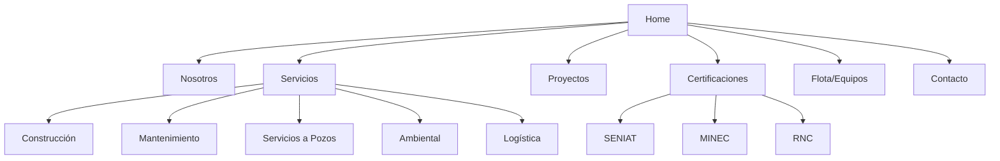

# Plan de Implementación - Maquetado Estructural Grupo Lormar

Este plan detalla la reestructuración del sitio web de Grupo Lormar para alinear su contenido y jerarquía con el brochure corporativo, manteniendo la fase de maquetado (sin color/monocromático).

## 1. Definición del Escorial (Scope)
Refinar la estructura del portal web alineándola con las 5 categorías de servicios del brochure y añadiendo la sección de certificaciones críticas (SENIAT/MINEC). Mejorar la jerarquía visual de la navegación y secciones principales.

## 2. Cambios Estructurales Principales

### 2.1. Navegación y Header
- Ajustar links de navegación para reflejar la importancia de "Certificaciones" y "Flota".
- Incorporar "Cotizar" como CTA principal destacado estructuralmente.

### 2.2. Hero Section
- Refinar el copy para usar términos del brochure ("Servicios y Construcciones Lormar 77, C.A.").
- Asegurar que el CTA secundario lleve a "Certificaciones" o "Servicios".

### 2.3. Sección de Servicios (Alineación con Brochure)
Reemplazar/Expandir las 3 categorías actuales por las 5 oficiales:
1. **Construcción** (Obras civiles, mecánicas, oleoductos).
2. **Mantenimiento** (Correctivo, equipos rotatorios/estáticos, NDT).
3. **Servicios a Pozos** (Estimulación, reacondicionamiento).
4. **Servicio Ambiental** (Residuos, saneamiento, remediación).
5. **Servicio Logístico** (Transporte especializado, alquiler de maquinaria).

### 2.4. Nueva Sección: Certificaciones y Confianza
- Añadir sección con logos/gráficos representativos de:
    - SENIAT (RUC/RIF).
    - MINEC (Manejadores de sustancias).
    - RNC (Registro Nacional de Contratistas).

### 2.5. Maquinaria y Flota
- Estructurar una sección o "preview" de la flota categorizada:
    - Izamiento (Grúas).
    - Movimiento de Tierra (Excavadoras, Retro).
    - Transporte (Bateas, Chutos).

## 3. Diagrama de Arquitectura de Información

## 4. Pasos de Ejecución

1. [ ] **Fase 1: Preparación** - Crear carpetas de assets si faltan.
2. [ ] **Fase 2: Refactorización de `page.tsx`** - Actualizar copys y secciones de servicios.
3. [ ] **Fase 3: Implementación de Certificaciones** - Nueva sección en la home.
4. [ ] **Fase 4: Refinamiento de Footer/Header** - Sincronizar con datos oficiales del brochure.
5. [ ] **Fase 5: Documentación** - Actualizar `README.md`.
